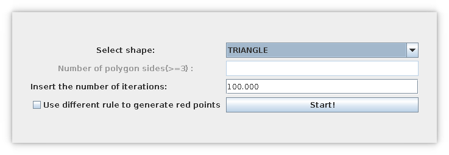
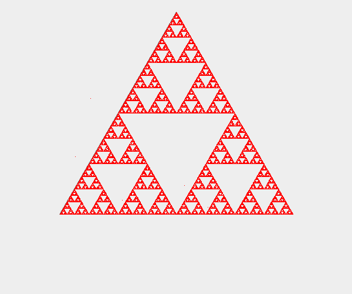
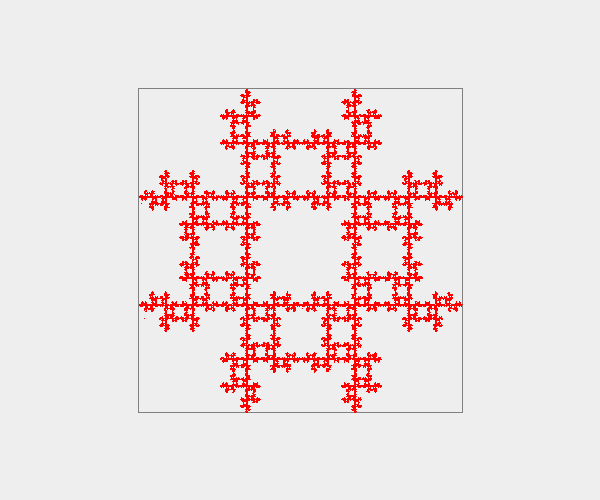
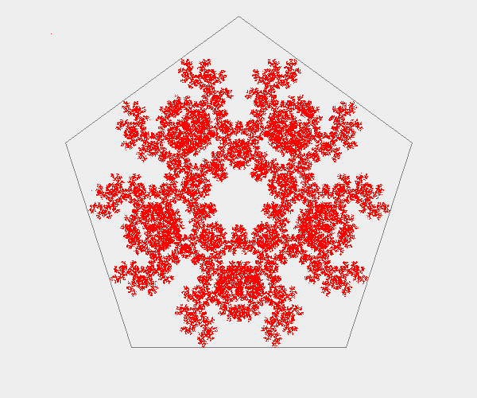
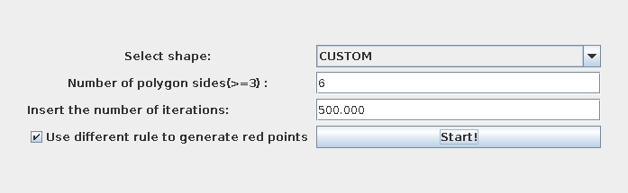
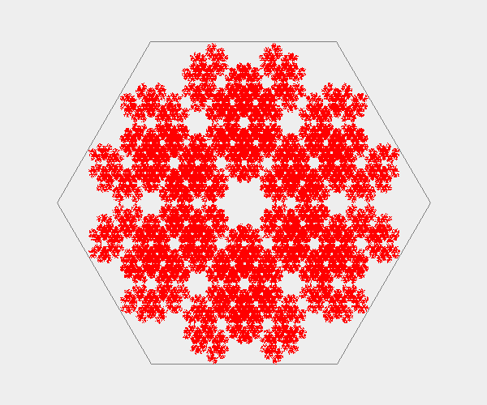

# Chaos-Game
A simple Java gui app that creates fractals applying specifics rules to random generated points.

For more information abaout *chaos game* and *fractal* visit the [Algorithm Archive](https://www.algorithm-archive.org/contents/IFS/IFS.html), the [Wikipedia page](https://en.wikipedia.org/wiki/Chaos_game) or the [Wolfram one](https://mathworld.wolfram.com/ChaosGame.html).

### Table of contents
* [About The Project](#about-the-project)
* [Getting Started](#getting-started)
* [Built With](#built-with)
* [License](#license)

## About The Project
Chaos game is a method to create **fractals** using an initial point selected at random inside a polygon and then applying a rule to find the next point. After some iterations we will often (depending on the rule) start seeing the shape.

This project aim is to create a **gui** that allows to simple generate fractal using the above method.

The main window allows to select from three polygons (Triangle, Squere, Pentagon) or to create yours (Custom) by choosing the number of sides (wich obviously must be greater then three) and to insert the number of iterations.

You can also select two different rules to generate the points: both of them starts from a random point inside the shape, select a vertex of the polygon and then choose the mid point of the distance between the previous point and the vertex as the new point form wich reiterate this algoritm.  
In the first rule (the default one for the triangle) the vertex is choosen randomly, while in the second one (the default for other shapes) is added one condition: it must be different from the previous one.

  

 Main window with default settings for Triangle 

 

 Trinagle fractal (also known as Sierpiński triangle) 

  

 Square fractal 

  

 Pentagon fractal 

   

 Main window with custom settings for Esagon 

  

 Esagon fractal 

   

## Getting Started

### Prerequisites
This project requires:

+ Java 11 or newer

### Quick start
To run this project from the commnad line (on Unix systems) follw this steps:

1. Clone the reposiory: ``git clone git@github.com:akanok/Chaos-Game.git``  or  ``git clone https://github.com/akanok/Chaos-Game.git``
2. Move into the project folder: ``cd Chaos-Game/``
3. Create _bin_ folder for _.class_ files: ``mkdir bin``
4. Compile java files: ``javac -sourcepath src/ -d bin/ src/chaos/game/*.java``
5. Move into the _bin_ folder: ``cd bin/``
6. Run the app: ``java chaos.game.Main``

If you prefere you can also create a `.jar` and execute it:

1. Steps `1` to `5` are identically as before
6. Create `.jar` archive: `jar cvfe MyApp.jar chaos/game/Main chaos/game/*`
7. Run the app: `java -jar MyApp.jar`

## Built With
* [JDK 11](https://www.oracle.com/it/java/technologies/javase/jdk11-archive-downloads.html)

## License
This project is licensed under MIT.  
Please see the [LICENSE](/LICENSE) file for details.
